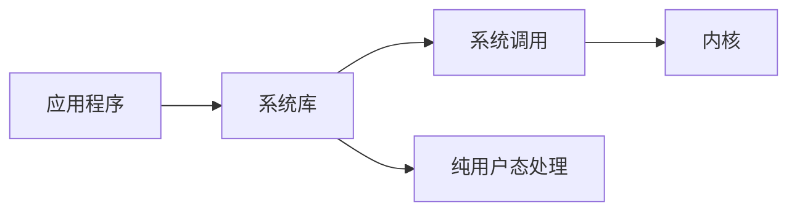
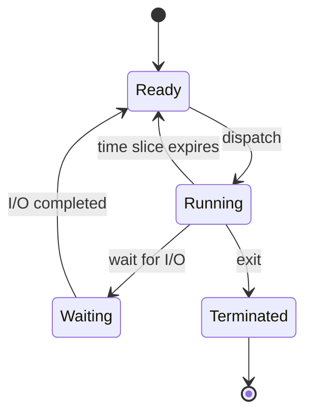

# 排版审校

**状态**：可增长审校手册  
**用途**：在文档冻结前逐项检查 Markdown、标题、段落、列表、表格、代码格式、数学和 Mermaid 是否准确表达原文关系。普通生成阶段不必全部加载。  
**依赖**：《文档排版》  
**来源**：检查项由旧 07A 重组；为避免迁移时丢失细节，原始细则手册完整保留在检查表之后。

# 1. 使用方式

每个检查项使用稳定编号。以后发现新的 Bad Case 时，直接在对应编号区间追加，不必重写整份手册。检查项分为三级：

| 级别 | 含义 | 处理原则 |
| --- | --- | --- |
| A | 会改变事实、结构或关系 | 必须修改 |
| B | 明显增加误解或阅读阻力 | 冻结前优先修改 |
| C | 风格、兼容性或一致性 | 视交付要求处理 |

执行顺序默认是 A → B → C。普通草稿可以只运行 A；准备长期保存时运行 A、B；正式冻结或发布时再完整运行 C。

# 2. 检查项

## 2.1 结构语义

- **P001 · A**：标题、列表、表格、公式或图是否增加了正文没有确认的顺序、因果、层级、排他性、基数或完整性？
- **P002 · A**：将结构化表达重新翻译成自然语言后，是否仍然只得到原文已经支持的事实？
- **P003 · A**：集合、大括号、分类树、状态图或完整流程图是否制造了「只有这些」的穷尽暗示？
- **P004 · B**：只列代表项、常见项或当前关注项时，是否明确写出「例如」「常见」「主要」「当前」等范围？
- **P005 · B**：结构化表达是否确实比自然段更清楚，而不是只让页面显得更丰富？
- **P006 · B**：同一关系是否被自然段、表格、公式和图重复表达，却没有新增信息？

## 2.2 标题、段落与编号

- **P020 · B**：一个自然段是否完成一个相对完整的解释动作，而不是一句一段或短语一段？
- **P021 · B**：连续因果、推导或叙事是否被无意义地拆成多个短段？
- **P022 · B**：一个段落是否同时承担三个以上彼此独立的认知任务，需要拆开？
- **P023 · B**：合并后的段落是否只是使用逗号、分号机械拼接，缺少因果、递进、对比或总分关系？
- **P024 · B**：标题是否对应真实主题或层级，而不是普通强调、过渡句或一句结论？
- **P025 · C**：短文是否为了形式完整使用过多标题？长文是否缺少真正需要的分区？
- **P026 · C**：同一层级是否混用多套编号体系？
- **P027 · C**：标题是否使用「补充」「注意」「其他」等无法承担索引作用的空泛名称？
- **P028 · C**：文件名已经承担标题时，正文是否又机械重复同名 H1？若文档需要独立导出，标题层级是否统一下移？

## 2.3 列表与表格

- **P040 · A**：列表项目是否真的处于同一逻辑层级？
- **P041 · B**：连续过程是否被误拆成并列列表，导致先后和因果消失？
- **P042 · B**：普通短并列是否可以直接使用顿号、逗号或自然句，而无需占用多行列表？
- **P043 · A**：表格各行是否共享同一组比较维度？
- **P044 · B**：表格是否明显减少重复句式或帮助横向比较？
- **P045 · B**：单元格是否塞入连续数句正文，说明内容应回到自然段？
- **P046 · B**：一张表是否承担多个不同比较目的，列数持续膨胀？
- **P047 · C**：表格中的 `|`、逻辑 OR 或其他敏感字符是否已经正确处理？

## 2.4 代码、强调与引用

- **P060 · A**：行内代码是否只用于真实标识、命令、路径、函数、配置值、协议字面量等需要保持原样的对象？
- **P061 · B**：普通概念或抽象关系是否为了视觉效果被包进反引号？
- **P062 · B**：多行代码块是否确实需要保留字面格式，而不是普通自然语言或概念列表？
- **P063 · B**：引用块是否承载真正引用的材料，而不是模型自己总结的「金句」？
- **P064 · C**：粗体是否只突出少量需要扫描定位的重点？
- **P065 · C**：是否存在 `**标签：**正文`、`**Token**后` 等边界粘连或渲染风险？
- **P066 · C**：中文正文是否无必要地使用斜体承担主要强调？

## 2.5 数学

- **P080 · A**：公式是否表达真正成立的形式关系，而不是将普通流程装饰成数学？
- **P081 · A**：`=` 是否只表示定义、恒等或当前模型中明确成立的等价关系？
- **P082 · A**：`+` 是否确实表示可加总或已经说明的组成关系？
- **P083 · A**：`→`、`↦`、`⇒`、`⇔` 是否分别符合过程、映射、蕴含和等价的真实语义？
- **P084 · A**：集合、量词、函数、概率和复杂度记号是否制造了原文没有的严格性？
- **P085 · B**：教学模型是否明确限定范围，避免读者将它误认为真实系统的穷尽组成？
- **P086 · B**：短关系是否被无必要地独立成展示公式？
- **P087 · B**：`aligned`、`cases`、矩阵或 `array` 是否真的有对齐、条件定义或二维关系需要？
- **P088 · C**：数学环境中的技术字面量是否根据需要使用 `\mathtt{}`，概念名称是否仍使用 `\text{}`？

## 2.6 Mermaid 与其他图形

- **P110 · A**：图中的箭头是否得到正文支持，且没有将普通相关误画成调用、依赖、因果、迁移或时序？
- **P111 · A**：节点位置和层级是否让读者推断出不存在的包含、继承或从属关系？
- **P112 · A**：状态图是否真的定义状态空间与合法迁移，而不是只列举几个常见状态？
- **P113 · A**：实体关系图中的一对一、一对多、可选性等基数是否有事实依据？
- **P114 · A**：时序图是否只在时间顺序和参与者边界确实重要时使用？
- **P115 · B**：只展示主路径、关键参与者或节选结构时，是否说明省略范围？
- **P116 · B**：一条短线性关系是否可以使用正文或数学箭头，避免低密度流程图？
- **P117 · B**：`mindmap` 是否制造封闭分类树，或与正文标题层级重复？
- **P118 · C**：当前渲染环境是否支持所选图型和语法？
- **P119 · C**：配色是否只帮助识别，没有替代文字标签或定义事实？

## 2.7 中文、英文、数字与空格

- **P140 · C**：中文正文是否使用全角标点，并统一使用外层「」、内层『』？
- **P141 · C**：中文补充说明是否优先使用全角括号，代码、函数、公式和原文是否保持半角符号？
- **P142 · C**：中文与独立英文术语、阿拉伯数字、行内代码或行内数学之间是否保留一个半角空格？
- **P143 · C**：中文标点前是否误留空格？
- **P144 · C**：路径、版本号、URL、命令参数、函数调用等不可拆分字面量是否保持原样？
- **P145 · C**：中文普通并列是否滥用 `/`，已经稳定的 `I/O`、`Client/Server` 等写法是否又被强行改写？
- **P146 · C**：半角连字符是否被用作中文破折号？
- **P147 · B**：同一术语在同一章节中的中文主称、英文主称或缩写是否前后摇摆？

## 2.8 文档分工与收尾

- **P160 · B**：主文是否被完整命令语法、参数清单、术语词典或高频变化材料打断？
- **P161 · B**：附录、速查页或问题索引是否承担了独立职责，而不是与主文长期复制同一内容？
- **P162 · B**：正文是否已经达到最小充分，却仍然通过新增格式继续生长？
- **P163 · C**：标题、表格、公式、图和交叉引用在局部修改后是否仍然一致？

# 3. 原始细则手册

以下内容保留旧 07A 的完整细则和示例，作为检查项的解释库与迁移底稿。后续新增检查项时，不要求同步改写这一部分。

# 技术学习笔记 Markdown 排版与结构规范（旧 07A 原文）

本规范用于技术学习笔记、主干手册、工程专题和较长的技术解释。目标是让内容适合在 Obsidian 与桌面端 Markdown 环境中长期阅读和维护：**层级稳定、正文连续、图表紧凑、术语统一、结构保真，并尽量减少无意义的纵向占用。**

本规范负责 Markdown 结构、标题、图表、数学、术语锚点、代码字体、标点和正文分工。具体行文由配套的《07B 技术学习笔记 Plain Chinese 行文规范》负责。两份规范共同使用：07A 决定「怎样组织和呈现」，07B 决定「怎样把话写清楚」。

---

# 1. 总体原则

技术笔记首先是可以连续阅读的正文，其次才是知识卡片、速查表和图示集合。默认面向桌面端，不模拟手机端或短视频式排版。

整体遵循以下原则：

- 正文以自然段为主，一个完整解释单元尽量在同一自然段中完成，不把一句话或一个因果链拆成大量短行。
- 标题只表达真实的知识层级，不为了强调一句话频繁新增标题。
- 并列比较、状态映射、命令速查等内容优先使用表格，充分利用桌面端横向空间。
- 真实存在于计算机世界中的字面对象使用行内代码。
- 人为抽象出的关系、组成、映射、状态迁移和简单二维结构，在**不会引入额外语义**的前提下可以使用数学格式。
- 出现明显分支、汇合、循环、跨层网络、多主体时序或明确的数据 / 对象关系时，可以使用 Mermaid；图型必须与实际语义匹配，不为了「有图」而画图。
- 普通重点使用粗体；引用只用于少量真正重要的原则、结论或停止线。
- 正文先建立正面模型，再处理真正会破坏当前理解的误区，不把边界条件当作默认叙述方式。
- 新术语只在确有必要时引入。一个概念能够用现有模型解释时，不为了「更专业」额外引入一串低复用率名词。
- 正文行文默认遵循配套的 Plain Chinese 规范：专业术语可以专业，解释这些术语的中文不必跟着专业化。

> 判断标准：复制到普通 Markdown 编辑器后，应更接近技术书、教程章节或技术博客，而不是 PPT、知识卡片、手机公众号或短视频脚本。

## 1.1 结构化表达的语义保真原则

数学公式、集合、表格、列表和 Mermaid 都不是单纯的排版装饰。它们会天然携带额外语义，例如「成员是否穷尽」「箭头是否表示先后或因果」「关系是否具有方向」「状态是否只能这样迁移」「实体是否是一对多」「图中对象是否构成完整系统」。因此，**结构化表达的第一目标是语义保真，紧凑、美观和可扫描性都排在其后。**

在把自然语言改写成数学结构或 Mermaid 之前，先做三项检查：

- **事实等价检查**：把公式或图重新翻译回自然语言后，是否只得到原文已经明确支持的事实。如果结构让读者多推断出新的顺序、因果、排他性、完整性、基数或层级关系，就说明表达过强。
- **穷尽暗示检查**：集合、大括号、状态图、分类树、对象图和完整流程图都容易让人理解成「只有这些」。如果当前内容只是举例、常见情况或节选，不使用会产生封闭枚举感的结构；必要时直接写「例如」「常见」「主要」并保留自然语言。
- **结构强度检查**：只有当方向、包含、映射、等价、先后、基数、状态迁移等关系本身就是知识内容时，才使用对应符号或图型。不能仅因为某种结构看起来清晰，就替原文补上这些关系。

例如，如果只知道线程「常见」有 `Running`、`Ready`、`Waiting` 等状态，就不要直接写成一个看起来封闭的集合，除非当前模型已经明确这些状态构成完整状态域。同样，如果一张 `flowchart` 只展示正常路径，应在上下文中明确它是「主路径」或「简化路径」，不要让图形暗示异常路径不存在。

> **结构不能替内容做决定。任何公式、集合、表格或图，只能压缩已经成立的语义，不能为了整齐而补充原文没有承诺的事实。**

---

# 2. 标题层级与编号

## 2.1 标题表示什么

标题表示**知识的逻辑层级**，不是视觉强调工具。层级越深，表示当前内容越依赖上一级主题。

| Markdown 层级 | 默认职责 | 使用边界 |
| --- | --- | --- |
| H1 `#` | 顶层章节 / 大模块 | 一个文件可有多个顶层章节；如果文件名已承担文档标题，不重复写同名标题 |
| H2 `##` | 章内主要主题 | 一个 H1 下的核心分块 |
| H3 `###` | 机制、对象或问题子块 | 真正存在从属关系时使用 |
| H4 `####` | H3 内的进一步拆分 | 谨慎使用，避免为了几句话继续下钻 |
| H5 `#####` | 极少数复杂结构的最后一级 | 只有长期维护确有价值时使用 |

默认不使用 H6。若内容需要持续下钻到 H6，优先检查是否应该拆成新章节、表格、附录或独立文件。

## 2.2 文件名与 H1 的关系

在 Obsidian 中，**文件名通常已经承担文档标题功能**。例如文件名为「Python Runtime.md」，正文通常直接从顶层章节开始：

```markdown
# 1. Runtime 的定位

# 2. Python 程序如何启动
```

不必再次写：

```markdown
# Python Runtime
```

如果文档需要脱离文件名独立导出、打印或发布，可以将文档标题作为唯一的首个 H1，再把正文整体下移一级。两种模式二选一，同一文档内不要来回切换。

## 2.3 编号规则

编号用于帮助长文定位和交叉引用，不是每个标题都必须编号。

技术主干手册、工程专题等长文如果采用编号，默认使用连续的阿拉伯数字层级：

```markdown
# 1. 顶层章节
## 1.1 主要主题
### 1.1.1 子主题
```

原则：

- 一旦采用编号，同一逻辑层级保持一致，不混用 `一、`、`1.`、`（1）` 等多套体系。
- H4、H5 通常可以只写语义标题，不必机械扩展到 `1.1.1.1.1`；只有确有交叉引用需求时再编号。
- 短文、散文式技术文章或问题索引可以不编号。
- 标题本身应直接说明内容，不使用「补充」「注意」「其他」「再说一点」等空泛标题。
- 不为一两句话单独建立标题。能够并入上一段时，优先并入。

## 2.4 标题命名方式

标题优先使用**名词、名词短语或名词并列结构**，使目录本身能够承担索引功能。标题用于标记「这一节讨论什么对象或主题」，正文再负责解释「为什么、怎样、有什么影响」。

推荐：

```markdown
### 进程、线程与地址空间
### 文件描述符与内核资源
### 缓存一致性
```

通常避免把标题写成完整的解释句、问句或带明显网络文章风格的判断句，例如「为什么进程需要文件描述符」「缓存到底解决了什么问题」「你真的理解 Runtime 吗」。这些内容更适合放在标题后的正文中。

如果单纯的名词短语不足以区分主题，可以使用「名词主题：限定说明」的形式，例如「动态链接：装载期与运行期绑定」。冒号后的内容应承担必要的范围限定，而不是把标题扩写成一句摘要。能够仅用名词或名词并列准确索引时，不额外添加解释性副标题。

---

# 3. 正文、列表与代码块

## 3.1 正文默认使用自然段

一个自然段尽量完成一个完整的解释动作，例如「提出对象 → 解释作用 → 给出因果 → 得出当前结论」。Markdown 渲染器会自动换行，不手动模拟窄屏阅读。

推荐：

Shell 会根据 `PATH` 搜索外部程序。程序启动以后形成进程，进程的行为还会受到参数和环境变量影响，因此「找到哪个程序」和「程序以什么环境运行」是两个不同问题。

避免：

```text
Shell 会根据 PATH 搜索程序。

然后启动程序。

程序形成进程。

环境变量也会影响进程。
```

尤其避免两三个字、一个短语或一个对象单独占一行。若几个词只是并列关系，直接使用顿号、逗号或表格。

## 3.2 列表只用于真实并列

列表适合多个独立步骤、分类、条件或检查项。如果这些内容实际上组成一个连续句子，不要为了视觉效果拆成列表。

例如，若内容只是「进程拥有线程、地址空间和资源」，优先写成自然句或数学组成关系，而不是三个 bullet。若列表只列出示例、常见项或当前关注项而非完整分类，应在引导句中明确「例如」「常见」「主要」「当前关注」等范围，避免列表形式制造穷尽暗示。

## 3.3 代码块的使用边界

代码块用于需要保持原始字面格式的内容，例如：

- 多行程序代码；
- 配置文件；
- 多行 Shell 命令；
- 日志与命令输出；
- JSON、YAML、SQL 等结构化文本；
- 必须保持等宽布局的真实数据结构。

不要把普通概念列表、抽象关系、短命令或一句普通文字放进代码块。简单命令使用行内代码，抽象关系使用数学格式，复杂结构使用 Mermaid。

---

# 4. 行内代码与真实字面对象

行内代码表示**计算机中真实存在、真实书写或需要按原样输入的字面对象**。

| 类型 | 示例 |
| --- | --- |
| 命令 | `ps -ef` |
| 命令参数 | `-l`、`--verbose` |
| 路径 | `/usr/bin/python` |
| 环境变量 | `PATH`、`HOME` |
| 函数 / API | `read()`、`open()` |
| 文件描述符 | `fd 1` |
| 信号 | `SIGTERM` |
| 真实状态名 | `Running` |
| 文件名 / 库名 | `libc.so`、`app.py` |
| 配置值 | `PORT=8000` |
| 协议字面量 / HTTP 方法 | `GET`、`404` |

不要把人为抽象出的整条关系写成行内代码，例如：

```markdown
`进程 → fd → Socket → Connection`
```

这类内容属于数学或结构图。

> 核心判断：**代码字体表示「计算机里真的这样写」；数学格式表示「为了理解而抽象出的关系」。**

---

# 5. 数学与结构化关系排版

数学格式不仅用于真正的数学公式，也可以表示人为抽象出的关系、组成、映射、约束、状态变化和小型二维结构。它承担普通正文与 Mermaid 之间的中间层：比自然语言紧凑，比 Mermaid 轻量，但**只有在符号本身的语义确实成立时才使用**。

在 Obsidian / Markdown 中统一采用：

- 行内数学：`$...$`
- 独立展示数学：`$$ ... $$`
- `%%...%%` 是 Obsidian 注释语法，不是数学公式语法
- 默认不使用 `\[...\]` 作为展示数学格式

## 5.1 数学格式的使用边界

数学符号具有比自然语言更强的约束性。`=`、`\in`、`\subseteq`、`\Rightarrow`、`\Leftrightarrow`、`\mapsto`、`+` 等符号都不能只作为视觉连接符使用。采用某个符号之前，必须确认它通常携带的语义就是当前想表达的语义。

尤其注意以下边界：

- **集合不是普通罗列。** `\{A,B,C\}` 通常会产生「这些成员构成当前集合」的穷尽暗示。如果只是列举常见情况、示例或目前讨论到的成员，优先使用自然语言、列表或表格，并明确「例如」「常见」等范围。
- **等号不是「相关」。** `A=B` 只用于定义、恒等或当前模型中明确成立的等价关系；一般关联使用正文、箭头或其他更合适的关系。
- **加号不是通用连接符。** `A+B` 只有在当前上下文明确表示组成或可加总关系时使用，并在首次出现时说明它是教学抽象还是数学加法。不要随意使用 `\oplus`，因为它在数学和计算机语境中可能已有正式含义。
- **箭头不是统一的「有关系」。** 流程、状态迁移、函数映射、逻辑蕴含和双向关联使用不同符号；如果关系类型尚未确定，宁可保留自然语言。
- **公式化不应制造精确性幻觉。** 如果原文只有定性判断，不为了「像模型」而人为加入系数、权重、概率、严格函数关系或边界条件。

如果把一个公式恢复成自然语言后会得到比原文更强的结论，说明该公式不应使用。

## 5.2 行内数学与展示数学

短关系优先保留在正文中，例如「下一状态可以抽象为 $S_{t+1}=F(S_t,I_t)$」。只有公式本身是当前解释对象，或者需要多行、对齐、分组、条件定义和视觉突出时，才使用 `$$...$$` 独立展示。

不要为了让一个很短的关系「更显眼」而单独占一整个数学块。展示数学承担结构表达，不承担普通强调。

## 5.3 关系、箭头与逻辑

不同箭头承担不同语义：

| 关系 | 推荐写法 | 语义 |
| --- | --- | --- |
| 过程、转换、状态迁移 | $A\rightarrow B$ | A 经过过程进入 B |
| 带动作或条件的转换 | $A\xrightarrow{f}B$ | 箭头上的内容是动作、事件或条件 |
| 具体对象映射 | $x\mapsto y$ | 某个对象对应另一个对象 |
| 函数域关系 | $f:X\rightarrow Y$ | 函数从 X 映射到 Y |
| 逻辑蕴含 | $P\Rightarrow Q$ | P 成立可以推出 Q |
| 逻辑等价 | $P\Leftrightarrow Q$ | P 与 Q 在当前语境下等价 |
| 双向关联 | $A\leftrightarrow B$ | 二者存在双向关系，不表示先后过程 |

简单过程可以写成：

$$
\text{源代码}
\xrightarrow{\text{编译}}
\text{目标文件}
\xrightarrow{\text{链接}}
\text{可执行文件}
$$

不要用 $\Rightarrow$ 代替普通流程箭头，也不要用 $\leftrightarrow$ 表示尚未确认的双向依赖。

## 5.4 组成、分解与分组

一个对象可以用多个组成部分建立教学模型时，可以使用 `+`、`\underbrace{}` 或 `\overbrace{}`，但应明确这里表达的是「组成」而非数值相加。例如，如果本节只从执行、内存和资源三个观察面建立简化模型，可以写成：

$$
\text{本节进程模型}
=
\underbrace{\text{线程}}_{\text{执行}}
+
\underbrace{\text{地址空间}}_{\text{内存}}
+
\underbrace{\text{资源}}_{\text{资源}}
$$

这类公式是模型压缩，左侧必须体现模型范围；它不自动意味着真实 Process 只由这三部分构成，也不意味着组成部分彼此独立或数量固定。如果无法用简短限定消除这种误读，应直接改用自然语言。

## 5.5 集合、约束与逻辑条件

当「成员资格、集合运算或约束」本身就是知识内容时，可以使用集合符号，例如 $x\in S$、$A\subseteq B$、$A\cup B$、$A\cap B$、$A\setminus B$。如果当前模型**明确把某个集合定义为满足某条件的全部对象**，可以使用集合描述式。例如，假设本节把「就绪进程集合」定义为所有状态等于 `Ready` 的进程：

$$
\text{就绪进程集合}
=
\left\{
p\in\text{进程}
\mid
\operatorname{state}(p)=\mathtt{Ready}
\right\}
$$

量词 $\forall$、$\exists$ 适合表达真正的不变量、约束或存在性条件，例如「对所有对象成立」或「至少存在一个对象」。不要把普通经验性描述形式化成量词规则。

集合尤其遵循第 1.1 节的穷尽暗示检查：**只有当前内容确实定义了一个集合的成员范围时，才使用封闭枚举。** 如果只是「常见状态包括 Running、Ready、Waiting」，应直接这样写，而不是把它包装成看似完整的集合。

## 5.6 函数、状态与递推模型

当重点是「输出由哪些输入决定」时，可以使用函数或状态方程：

$$
S_{t+1}=F(S_t,I_t)
$$

如果系统同时产生输出，可以写成：

$$
(O_t,S_{t+1})=F(S_t,I_t)
$$

这类模型适合 CPU、有限状态机、协议、调度器和 Agent Harness 等主题，因为它明确表达「当前状态 + 输入 → 下一状态 / 输出」。只有在这种依赖关系本身成立时使用，不因为两个步骤前后相邻就强行写成函数关系。

函数复合 $h=g\circ f$ 可以在真正需要表达可组合变换时使用；普通工程流程仍优先使用箭头或正文。

## 5.7 数量、比较与统计关系

性能、容量、复杂度、概率和评测中可以正常使用标准数学符号：

| 语义 | 常用写法 |
| --- | --- |
| 严格相等 / 定义 | $=$ |
| 不等 | $\neq$ |
| 近似 | $\approx$ |
| 上下界 | $<,\leq,>,\geq$ |
| 成比例 | $\propto$ |
| 概率 | $P(A)$、$P(A\mid B)$ |
| 期望 | $\mathbb{E}[X]$ |
| 均值 | $\bar{x}$ |
| 方差 | $\operatorname{Var}(X)$ |
| 求和 | $\sum_i x_i$ |

例如：

$$
T_{\text{total}}
=
T_{\text{compute}}
+
T_{\text{memory}}
+
T_{\text{I/O}}
+
T_{\text{network}}
$$

上下标可以承担稳定的语义命名，例如 $S_t$、$x_i$、$T_{\text{network}}$。但不要为了形式整齐把本来无法加总、无法比较或只有定性相关的量写成严格公式。

## 5.8 多行、条件与二维结构

`aligned` 用于**属于同一个解释单元、且对齐能够帮助阅读的多行公式或关系**，不是机械限制为两到四行：

$$
\begin{aligned}
\text{源代码}
&\xrightarrow{\text{编译}}
\text{目标文件}
\\
\text{目标文件}+\text{库}
&\xrightarrow{\text{链接}}
\text{可执行文件}
\\
\text{可执行文件}
&\xrightarrow{\text{装载}}
\text{进程}
\end{aligned}
$$

`cases` 有两种主要用途：真正的数学条件定义，以及少量、明确且非网络化的概念分支。数学条件定义即使分支较多，也不因为「分支数量」自动改成 Mermaid；系统路径一旦出现明显汇合、循环、异常分支或跨层连接，则改用更合适的图型。

二维关系本身就是模型的一部分时，可以使用 `array` 或矩阵：

$$
\begin{array}{c|ccc}
 & \text{Owner} & \text{Group} & \text{Others} \\
\hline
\text{Read} & r & r & r \\
\text{Write} & w & w & w \\
\text{Execute} & x & x & x
\end{array}
$$

如果二维内容主要用于查阅、比较或包含较长说明，仍然使用 Markdown 表格。

## 5.9 阶段划分与核心模型

长链需要划分阶段时可以使用 `\underbrace{}` 或 `\overbrace{}`：

$$
\underbrace{
\text{Source}
\rightarrow
\text{Compile}
\rightarrow
\text{Executable}
}_{\text{构建阶段}}
\rightarrow
\underbrace{
\text{Load}
\rightarrow
\text{Process}
\rightarrow
\text{Execution}
}_{\text{运行阶段}}
$$

一章结尾真正需要突出、值得长期记忆的核心模型，可以少量使用 `\boxed{}`。不要给普通关系全部加框，也不要用框线替代标题、粗体或正文中的正常强调。

## 5.10 数学环境中的技术字面量

正文中的真实技术字面量继续遵循第 4 章的行内代码规则。进入数学环境后，如果需要表示一个按字面书写的短标识，可以使用 `\mathtt{}`，例如：

$$
\mathtt{fd}
\mapsto
\text{Kernel Resource}
$$

概念名称仍使用 `\text{}`。不要因为英文出现在数学环境中就全部改成等宽字体。

## 5.11 真正的数学公式

涉及性能、复杂度、概率、容量和吞吐量时，正常使用 LaTeX：

$$
\text{Throughput}
=
\frac{\text{Completed Requests}}{\text{Time}}
$$

$$
T(n)=O(n\log n)
$$

可以正常使用分数、上下标、求和、积分、极限、根号、矩阵、分段函数、对齐、概率和统计符号。规范限制的是**不必要的形式化**，不是限制真正需要的数学表达能力。

## 5.12 数学格式与 Mermaid 的边界

选择格式时同时判断「语义类型」和「结构复杂度」：

| 要表达的内容 | 默认格式 |
| --- | --- |
| 正文中的短公式或短关系 | 行内数学 `$...$` |
| 单条过程、转换、带条件迁移 | 数学箭头 / `\xrightarrow{}` |
| 映射、逻辑、约束、集合关系 | 对应数学符号，前提是其严格语义成立 |
| 多行且需要对齐的关系 | `aligned` |
| 数学条件定义 | `cases` |
| 小型二维数学结构 | `array` / matrix |
| 长链阶段划分 | `\underbrace{}` / `\overbrace{}` |
| 少量最终核心模型 | `\boxed{}` |
| 多分支、多汇合、循环或跨层网络 | Mermaid `flowchart` |
| 多主体按时间交互 | Mermaid `sequenceDiagram` |
| 真正的状态机 | Mermaid `stateDiagram-v2` |
| 对象 / 类的静态结构 | Mermaid `classDiagram` |
| 数据实体与基数关系 | Mermaid `erDiagram` |

判断原则：**如果自然语言已经足够准确，就不强制结构化；如果结构化会引入额外事实，就退回自然语言。只有在符号能更准确压缩既有语义时，才使用数学格式。**

---

# 6. 表格

桌面端笔记应充分利用横向空间。概念比较、对象与功能、状态与含义、命令参数、故障症状与工具、层级映射等内容，通常优先使用表格。

例如：

| 命令 | 英文来源 | 功能 | 常用参数 |
| --- | --- | --- | --- |
| `ps` | process status | 查看进程 | `-e`、`-f`、`-p` |
| `ss` | socket statistics | 查看 Socket | `-l`、`-n`、`-t` |
| `lsof` | list open files | 查看进程打开的资源 | `-p`、`-i` |

正文负责解释「为什么存在」「位于哪一层」「怎样与上下文连接」；完整语法、参数和速查信息尽量集中到附录。

表格本身也要控制密度：

- 单元格优先写短语或短句，不塞入大段正文。
- 如果一格需要连续解释数句，通常说明内容应该回到正文。
- 同一张表只承担一个比较维度，不为了「全部装进去」不断增加列。
- 如果表格中的行或列只是常见项、代表项或节选，而不是完整全集，应在表题、引导句或列名中明确范围，避免二维结构制造完整分类的错觉。
- 表格适合查阅，因果叙事仍以自然段为主。

---

# 7. Mermaid

Mermaid 用于自然语言、数学格式和 Markdown 表格已经不足以清楚表达的**图结构**。它不是默认装饰，也不是所有关系的高级版本。每一种 Mermaid 图型都会携带特定语义，因此选择图型之前，先判断「这个图天然会让读者相信什么」。

## 7.1 Mermaid 的语义保真边界

Mermaid 图中的节点、箭头、位置、顺序、包含关系和基数都可能被读者理解为知识本身。绘图前必须遵守第 1.1 节，并额外检查以下问题：

- 图中省略的对象或路径，是否会让人误解为不存在。如果只是展示主路径、关键参与者或节选结构，应在图前或图后明确限定范围。
- 箭头是否真的表示方向、调用、依赖、消息、迁移或先后；不要用箭头仅仅表示「二者有关」。
- 节点层级是否真的表示包含、继承或从属；不要为了视觉布局制造并不存在的层级。
- 顺序是否真的有时序含义。特别是 `sequenceDiagram`、`timeline`、`gantt` 和 `gitGraph`，顺序本身就是信息。
- 专用图型中的强语义是否已经得到支持，例如 `erDiagram` 的一对多基数、`stateDiagram-v2` 的合法状态迁移、`classDiagram` 的继承或组合关系。

如果一张图只有在添加大量「此处省略」「不代表完整关系」「仅示意」之后才不误导，通常说明当前内容不适合画成这种图。

## 7.2 流程与网络：`flowchart`

`flowchart` 用于过程中的分支、汇合、循环、跨层连接和一般网络结构。例如，假设当前只讨论应用调用系统库后的两条主路径：



如果图只表达正常路径，应明确它是「主路径」或「简化路径」。简单的 $A\rightarrow B\rightarrow C$ 不为了「有图」而改成 `flowchart`。

## 7.3 多主体时序：`sequenceDiagram`

当重点是「谁先向谁发送什么、谁随后响应」时使用 `sequenceDiagram`，例如程序启动、Client / Server 交互、RPC、系统调用进入 Kernel、Agent 调用 Tool 等过程。

`sequenceDiagram` 天然强化时间顺序和参与者边界。并发、异步、重试或异常路径如果会改变理解，应明确表达；如果当前只想说明参与关系而不想承诺严格先后，不使用时序图。

## 7.4 状态机：`stateDiagram-v2`

当重点是「一个对象有哪些状态，以及什么事件触发状态迁移」时使用 `stateDiagram-v2`。它适合进程 / 线程状态、协议状态、任务生命周期、Agent Harness 等真正的状态机。下面仅示范语法，假设当前教学模型明确采用这些状态与迁移：



状态图很容易产生「这些就是全部状态和全部合法迁移」的暗示。只有当前模型确实需要定义状态空间时才使用；若只是举几个常见状态，优先自然语言或表格。

## 7.5 对象与类结构：`classDiagram`

当重点是「对象 / 类拥有哪些属性和行为，以及继承、关联、组合等静态关系」时使用 `classDiagram`。它适合面向对象设计、框架源码结构、领域模型和部分架构对象关系。

不要把一般模块依赖强行画成类图。图中的继承、组合、关联方向都属于强语义，只有代码或设计模型确实支持时才标注。

## 7.6 数据实体与基数：`erDiagram`

数据库建模、领域数据模型中，如果重点是实体、字段以及一对一、一对多、多对多等基数关系，使用 `erDiagram`。

`erDiagram` 的基数不是视觉装饰。例如一旦画出一对多，就等于对数据模型做了明确断言；如果当前只知道两个实体「有关」，而不知道基数或可选性，不应为了图完整而猜测。

## 7.7 专题型图表

以下图型可以按主题使用，但不提升为所有技术笔记的默认选择：

| Mermaid 图型 | 适合内容 | 主要边界 |
| --- | --- | --- |
| `gitGraph` | Git 提交、分支、合并历史 | 图中历史应对应真实或明确假设的提交关系，不把示意图写成真实历史 |
| `timeline` | 技术史、版本演化、事件序列 | 默认容易被理解为按时间选取的重要事件；节选时明确「节选」 |
| `gantt` | 项目阶段、任务时间跨度 | 日期、依赖和持续时间都具有计划语义，不拿它表达模糊先后关系 |
| `mindmap` | 一个主题下的概念展开 | 容易形成封闭分类树和父子层级暗示，只适合真正的概念总览，不替代 H1–H5 正文结构 |

`mindmap` 尤其克制使用。当前规范已经使用标题层级承担知识树功能，只有一章开头确实需要概念鸟瞰时才考虑思维导图。

## 7.8 图型选择与兼容性

选择 Mermaid 图型时优先问「我要表达的是什么关系」，而不是「哪种图看起来更丰富」：

| 核心问题 | 优先图型 |
| --- | --- |
| 一个过程怎样分支、汇合或循环 | `flowchart` |
| 多个参与者怎样按时间交互 | `sequenceDiagram` |
| 一个对象怎样在状态之间迁移 | `stateDiagram-v2` |
| 软件对象 / 类之间是什么静态关系 | `classDiagram` |
| 数据实体之间是什么基数关系 | `erDiagram` |
| Git 历史怎样分叉和合并 | `gitGraph` |
| 历史事件怎样沿现实时间展开 | `timeline` |
| 项目任务怎样跨时间安排 | `gantt` |
| 一个主题有哪些概念分支 | `mindmap`，少量使用 |

不同 Markdown / Obsidian 环境内置的 Mermaid 版本可能不同。使用较新的或较少见的图型前，应确认当前渲染环境支持；如果兼容性不稳定，优先退回 `flowchart`、表格或正文，而不是为了保留图型牺牲可维护性。

> **Mermaid 只负责把已经确认的结构显式化，不负责替正文猜测系统结构。**

---

# 8. 标点、括号与特殊符号

## 8.1 中文正文的标点偏好

中文技术笔记默认使用中文全角标点：`，。；：！？（）`。中文标点前后不额外插入空格。

引号统一使用直角引号：

- 第一层：「」
- 引号内部再次引用：『』

例如：

Linux 所谓「一切皆文件」，更准确地说，是强调『很多资源可以通过相似的 fd / I/O 接口操作』。

默认不使用中文弯引号 `“”‘’`。英文原文、代码、命令输出、协议文本等保持原样，不强行替换。

## 8.2 括号

中文正文中的补充说明优先使用中文全角括号 `（）`：

```text
系统调用（System Call）是用户态请求 Kernel 能力的入口。
```

代码、函数调用、正则表达式、命令、数学表达式以及其他真实技术字面量中的半角括号 `()` 保持原样，例如 `read()`、`if (x > 0)`。

## 8.3 中文与英文、数字、行内代码的空格

中文正文与独立英文术语、阿拉伯数字、行内代码或行内数学之间，通常保留一个半角空格，以提高桌面端可读性；中文标点前不额外留空格。

例如：

```text
Python Runtime 运行在 User Space 中，并通过 `read()` 等接口访问文件。
```

如果英文、数字或符号属于一个不可拆分的真实字面量，例如路径、版本号、函数调用、URL、命令参数，则保持原样。

## 8.4 斜杠、连字符与技术符号

中文自然语言中的普通并列优先使用顿号、逗号或「与」，不为了省字大量使用 `/`。但已经形成稳定技术写法的 `I/O`、`Client/Server`、路径 `/usr/bin`、命令参数等保持原样。

中文正文一般不使用半角连字符 `-` 充当中文破折号。若表达中文插入语，优先直接改写句子，必要时使用中文破折号 `——`。

## 8.5 Markdown 敏感符号

有些符号在 Markdown 中兼具语法功能，需要单独处理。当前重点记录如下，后续遇到新的渲染问题继续追加到本小节，不另起大章节。

| 符号 | 场景 | 处理方式 |
| --- | --- | --- |
| <code>&#124;</code> | Markdown 表格中的 Pipe 字符 | 单元格内使用 `<code>&#124;</code>` |
| <code>&#124;&#124;</code> | Markdown 表格中的逻辑 OR | 单元格内使用 `<code>&#124;&#124;</code>` |
| `` ` `` | 行内代码边界 | 普通正文中需要展示反引号本身时，按 Markdown 转义或改用代码块 |
| `#` | 标题语法 | 作为技术字面量出现时使用行内代码，例如 `#include` |
| `>` | 引用语法 | 作为 Shell 重定向等真实字面量出现时使用行内代码 |

普通正文、代码块和 Mermaid 中可以按各自语法正常使用 `|`；真正需要特别规避的是 Markdown 表格单元格。

---

# 9. 中文与英文术语

## 9.1 首次出现与双语锚点

正式术语首次出现时，只要存在自然、可接受的中文名称，统一先建立一次双语锚点，默认格式为「中文术语（English Term, ABBR）」；没有通行缩写时省略缩写，例如「文件描述符（File Descriptor, fd）」「虚拟内存（Virtual Memory）」。不要在正文一开始直接连续堆叠英文术语，也不要为了形式完整而编造不存在或极少使用的缩写。

如果一个术语在某个标题中首次出现，**该标题本身就视为完成首次双语锚定**，例如：

```markdown
### 文件描述符（File Descriptor, fd）
```

随后正文直接按照本章约定使用「文件描述符」或 `fd`，不再重复写成「文件描述符（File Descriptor, fd）」。同一术语只需要在首次出现的位置建立一次中英对应关系。

概念性英文术语本身通常不是计算机中的真实字面量，因此不要仅因为它是英文就套用行内代码。只有 `PATH`、`SIGTERM`、`GET`、函数名、命令、文件名等真实标识或字面对象才遵循第 4 章的行内代码规则。

极少数确实没有稳定中文译名、中文技术社区也几乎直接使用英文的术语，可以直接使用英文，不为了满足格式而生造中文名称。

## 9.2 后续使用中文还是英文

完成首次双语锚定之后，后续写中文还是英文，不按「全部中文」或「全部英文」的统一偏好决定，而以**中文技术社区中的真实使用习惯和当前语境**为准。

| 社区使用情况 | 后续默认写法 | 示例 |
| --- | --- | --- |
| 中文译名成熟、自然且明显更常用 | 使用中文 | 进程、线程、权限、环境变量、系统调用 |
| 英文写法在中文工程语境中明显更常用 | 使用英文 | Shell、Socket、Runtime、Worker、Hook |
| 缩写已经成为最常见称呼 | 首次锚定后优先使用缩写 | CPU、API、HTTP、GC |
| 中英文都常见 | 根据所在技术社区和上下文选择更自然的一种，并在同一章节保持稳定 | 缓存 / Cache、运行时 / Runtime |
| 计算机中的真实标识或字面量 | 保持原样并使用行内代码 | `PATH`、`SIGTERM`、`GET` |

判断重点不是某个词「理论上有没有中文译名」，而是中文开发者在真实文档、讨论和工程环境中通常怎样称呼它。例如已经有稳定常用中文 counterpart 的概念，不因为原始资料是英文就强行全篇使用英文；反过来，社区长期直接使用英文的词，也不为了中文化而反复使用生硬译名。

一旦在具体章节中选定主要称呼，后续保持一致。只有在比较术语、解释 API 字面量、引用英文原文或消除歧义时，才再次出现另一种语言的写法。

## 9.3 新术语的引入密度

新名词引入应服务于当前模型。能够用已有概念解释时，不为了展示完整性再引入多个后续并不使用的术语。首次双语锚点的目的只是建立检索和对应关系，不意味着每个相关英文名词都值得进入主干正文。

---

# 10. 命令、参数与工具名

首次介绍重要命令时，尽量说明名称来源或常见英文含义；重要参数也应解释其语义，减少纯记忆。

例如：

| 命令 / 参数 | 英文来源或语义 | 含义 |
| --- | --- | --- |
| `ps` | process status | 查看进程状态 |
| `pwd` | print working directory | 显示当前工作目录 |
| `df` | disk free | 查看文件系统空间 |
| `du` | disk usage | 查看目录 / 文件占用 |
| `-h` | human-readable | 使用更易读的容量单位 |

如果名称本身不是缩写，明确说明「非缩写」即可，不强行编造全称。若某个参数的字母来源并无可靠、统一解释，只说明实际语义。

正文只保留最常用、最能支撑当前模型的命令示例；完整 CLI、参数和组合方式优先放到附录。

---

# 11. 行文规范入口

正文的措词、句法、术语解释、断言强度和读者前提统一遵循配套文件《07B 技术学习笔记 Plain Chinese 行文规范》。本文件不再重复维护一套详细文风规则，避免排版规范和语言规范相互覆盖。

在 07A 中只保留与结构直接相关的三条接口规则：

- 标题、表格、公式和 Mermaid 负责组织已经确认的知识结构，不能借排版替正文补充事实。
- 正式术语的首次双语锚点、真实字面量的代码字体和数学符号的严格语义继续按本文件执行。
- 正文若在「写得更短」和「保持准确」之间发生冲突，先保证准确，再按照 07B 把句子写得更直接、更容易读。

> **07A 负责结构保真，07B 负责语言清楚。两者都不能以牺牲知识精度为代价。**

---

# 12. 粗体、引用、斜体与强调

## 12.1 粗体

普通重点直接嵌入自然段使用粗体。每段只突出真正需要扫描定位的关键词或结论，避免整段多处加粗导致失去层级。

## 12.2 引用

引用块只用于：

- 课程级核心判断；
- 非常重要的原则；
- 明确的边界说明；
- 少量值得独立记忆的结论。

例如：

> **问题出现，不自动生成学习义务。只有会改变当前操作、预测、Debug 或设计的问题，才值得继续展开。**

不要为了制造「金句感」频繁使用引用。

## 12.3 斜体

中文技术笔记默认不使用斜体作为强调。英文原文、书名或确有传统排版需要时可以保留；一般强调使用粗体。

---

# 13. 正文、问题索引与附录的分工

主干正文负责连续模型：对象是什么、为什么需要、对象之间如何连接、核心机制怎样工作。

问题索引负责保留个人疑惑与应用案例。问题答案可以自然调用主干知识，但不强制添加「类型」「关联章节」「使用知识」等元数据，不把索引写成数据库。

附录负责高密度速查内容，例如完整命令语法、参数、子命令、工具组合、术语字典、扩展阅读入口。

因此，讨论中出现的有趣旁支不必为了保留而塞回主干；能用主干解释的问题，可以留在问题索引；完全不影响主线的细节则放到扩展资料或后置入口。

---

# 14. 最终格式选择表

任何格式选择都先经过第 1.1 节的语义保真检查。**如果结构化会引入原文没有承诺的完整性、顺序、因果、基数、层级、排他性或精确关系，默认退回自然语言。**

| 要表达的内容 | 默认格式 |
| --- | --- |
| 连续解释一个机制或因果链 | 自然段 |
| 多个真正独立的步骤 / 分类 | 列表；非穷尽时明确「例如」「常见」「主要」 |
| 真实命令、路径、变量、函数、文件名 | 行内代码 |
| 正文中的短公式或短抽象关系 | 行内数学 `$...$` |
| 需要独立解释的简单关系、组成、映射、约束 | 展示数学 `$$...$$`，前提是符号严格语义成立 |
| 多行且需要对齐的关系 | `aligned` |
| 真正的数学条件定义 | `cases` |
| 小型二维数学结构 | `array` / matrix |
| 横向比较、状态映射、命令速查 | Markdown 表格 |
| 多分支、汇合、循环、跨层网络 | Mermaid `flowchart` |
| 多主体按时间交互 | Mermaid `sequenceDiagram` |
| 真正的状态机 | Mermaid `stateDiagram-v2` |
| 对象 / 类的静态关系 | Mermaid `classDiagram` |
| 数据实体与基数关系 | Mermaid `erDiagram` |
| Git 提交与分支历史 | Mermaid `gitGraph`，专题使用 |
| 技术史 / 版本事件 | Mermaid `timeline`，专题使用 |
| 项目时间安排 | Mermaid `gantt`，专题使用 |
| 概念鸟瞰 | Mermaid `mindmap`，少量使用 |
| 多行真实代码、配置、日志、输出 | 代码块 |
| 普通重点 | 粗体 |
| 极少量核心原则 / 停止线 | 引用 |
| 高频查阅但会打断正文的细节 | 附录 |
| 个人化旧疑惑、案例和联想 | 问题索引 |

最终可以压缩为九条：

> **正文按长文阅读方式组织，不按手机碎片化排版。**  
> **标题表达层级，并优先使用可索引的名词或名词短语。**  
> **术语首次使用「中文术语（English Term, ABBR）」建立锚点，后续按中文技术社区的实际习惯选择中文、英文或缩写。**  
> **结构化表达先做语义保真检查；公式、集合、表格和图都不能补充原文没有承诺的事实。**  
> **真实字面量使用行内代码；数学符号只在其严格语义成立时使用。**  
> **横向比较使用表格；真正的流程、时序、状态、对象结构和数据关系再选择对应 Mermaid 图型。**  
> **中文标点、括号和术语写法保持统一，Markdown 敏感符号单独处理。**  
> **解释、判断和问句优先放在正文，不把标题写成网络文章式摘要。**  
> **主干追求连续和最小充分，不用边界条件、新名词和过度形式化不断打断当前模型。**  
> **正文措词与句法另按 07B 的 Plain Chinese 规范执行：该学的难来自知识本身，不由中文额外制造。**
